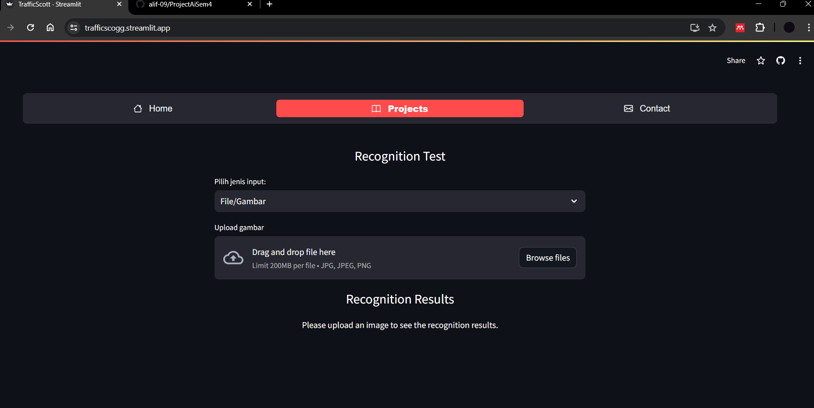

---

# Proyek Artificial Intelligence Semester 4
Teknik Informatika Universitas Padjadjaran Angkatan 2022

## Daftar Isi
1. [Tim](#tim)
2. [Dataset](#dataset)
3. [Proses](#proses)
    - [Pengambilan Dataset](#pengambilan-dataset)
    - [Persiapan Data](#persiapan-data)
    - [Instalasi Dependensi](#instalasi-dependensi)
    - [Persiapan Model](#persiapan-model)
    - [Pelatihan Model](#pelatihan-model)
        - [Hasil Pelatihan](#hasil-pelatihan)
        - [Confusion Matrix Sebelum Normalisasi](#confusion-matrix-sebelum-normalisasi)
        - [Confusion Matrix Setelah Normalisasi](#confusion-matrix-setelah-normalisasi)
    - [Deploy ke Streamlit](#deploy-ke-streamlit)
        - [Tampilan Website | Home](#tampilan-website--home)
        - [Tampilan Website | Project](#tampilan-website--project)
        - [Tampilan Website | Contacts](#tampilan-website--contacts)
4. [Pelatihan Model Menggunakan YOLOv8](#pelatihan-model-menggunakan-yolov8)

## Tim
- Giast Ahmad - 140810220018
- Alif Al Husaini - 140810220036
- Muhamad Danendra Syah Hidayatullah - 140810220064
- Rio Irawan - 140810220084
- Angga Prasetyo - 140810220086

## Dataset
Dataset yang digunakan dalam proyek ini adalah [GTSRB - German Traffic Sign](https://www.kaggle.com/datasets/meowmeowmeowmeowmeow/gtsrb-german-traffic-sign).

## Proses

Untuk menjelaskan isi dari dataset versi 1 (314.36 MB) yang terdiri dari meta, Test.csv, dan Train.csv, berikut adalah penjelasan dalam bahasa Indonesia yang dapat ditambahkan pada bagian proses dan pengambilan dataset:

### Pengambilan Dataset
Dataset Version 1 (314.36 MB) terdiri dari beberapa komponen utama:

#### Meta
Meta dataset ini berisi informasi metadata mengenai dataset tersebut, termasuk jumlah gambar uji (12.6k) dan total gambar latih (39.3k) yang terbagi dalam 43 kelas.

#### Test.csv
File Test.csv berisi informasi sebagai berikut:
- *Width*: Lebar dari gambar.
- *Height*: Tinggi dari gambar.
- *Roi.X1, Roi.Y1, Roi.X2, Roi.Y2*: Koordinat sudut kiri atas (X1, Y1) dan sudut kanan bawah (X2, Y2) dari tanda pada gambar.
- *ClassId*: ID kelas dari gambar.
- *Path*: Lokasi file gambar.

#### Train.csv
File Train.csv memiliki struktur yang serupa dengan Test.csv:
- *Width*: Lebar dari gambar.
- *Height*: Tinggi dari gambar.
- *Roi.X1, Roi.Y1, Roi.X2, Roi.Y2*: Koordinat sudut kiri atas (X1, Y1) dan sudut kanan bawah (X2, Y2) dari tanda pada gambar.
- *ClassId*: ID kelas dari gambar.
- *Path*: Lokasi file gambar.

#### Persebaran Data
 

### Persiapan Data
Data persiapan diubah ke format YOLO dengan anotasi gambar. 

Contoh Anotasi: 
 

Anotasi gambar bisa dilakukan melalui Roboflow, tetapi karena pada dataset kami sudah memiliki data Width, Height, Roi.X1, Roi.Y1, Roi.X2, Roi.Y2, ClassId, dan Path, kita bisa melakukan konversi secara manual menggunakan kode berikut:
python
import os
import pandas as pd
from shutil import copy2

def convert_to_yolo(row, width, height):
    x1 = row['Roi.X1']
    y1 = row['Roi.Y1']
    x2 = row['Roi.X2']
    y2 = row['Roi.Y2']

    box_width = x2 - x1
    box_height = y2 - y1
    center_x = x1 + box_width / 2
    center_y = y1 + box_height / 2

    center_x /= width
    center_y /= height
    box_width /= width
    box_height /= height

    return center_x, center_y, box_width, box_height

def process_csv(csv_path, images_root_dir, output_images_dir, output_labels_dir):
    data_csv = pd.read_csv(csv_path)
    for index, row in data_csv.iterrows():
        image_path = row['Path']
        image_name = os.path.basename(image_path)
        txt_name = image_name.replace('.png', '.txt')

        width, height = row['Width'], row['Height']
        center_x, center_y, box_width, box_height = convert_to_yolo(row, width, height)
        cls = row['ClassId']

        src = os.path.join(images_root_dir, image_path)
        dst = os.path.join(output_images_dir, image_name)

        os.makedirs(output_images_dir, exist_ok=True)

        if os.path.exists(src):
            copy2(src, dst)
        else:
            continue

        label_path = os.path.join(output_labels_dir, txt_name)
        os.makedirs(output_labels_dir, exist_ok=True)
        with open(label_path, 'w') as f:
            f.write(f'{cls} {center_x} {center_y} {box_width} {box_height}\n')

train_csv_path = '../input/gtsrb-german-traffic-sign/Train.csv'
test_csv_path = '../input/gtsrb-german-traffic-sign/Test.csv'
images_root_dir = '../input/gtsrb-german-traffic-sign'  
output_train_images_dir = 'datasets/train/images'
output_train_labels_dir = 'datasets/train/labels'
output_test_images_dir = 'datasets/val/images'
output_test_labels_dir = 'datasets/val/labels'

process_csv(train_csv_path, images_root_dir, output_train_images_dir, output_train_labels_dir)
process_csv(test_csv_path, images_root_dir, output_test_images_dir, output_test_labels_dir)

### Instalasi Dependensi
Instalasi ultralytics untuk YOLOv8:

sh
!pip install ultralytics==8.0.196

### Persiapan Model
Setelah anotasi selesai, buat file data.yaml yang mendefinisikan lokasi dataset dan jumlah kelas. Contoh file data.yaml:

yaml
train: /kaggle/working/datasets/train/images
val: /kaggle/working/datasets/val/images

nc: 43
names: [
  'class_0', 'class_1', 'class_2', 'class_3', 'class_4', 'class_5', 'class_6', 'class_7', 'class_8', 'class_9',
  'class_10', 'class_11', 'class_12', 'class_13', 'class_14', 'class_15', 'class_16', 'class_17', 'class_18', 'class_19',
  'class_20', 'class_21', 'class_22', 'class_23', 'class_24', 'class_25', 'class_26', 'class_27', 'class_28', 'class_29',
  'class_30', 'class_31', 'class_32', 'class_33', 'class_34', 'class_35', 'class_36', 'class_37', 'class_38', 'class_39',
  'class_40', 'class_41', 'class_42'
]

### Pelatihan Model
Gunakan kode berikut untuk melatih model YOLOv8:

python
from ultralytics import YOLO

data_path = '/kaggle/input/data-yaml/data.yaml'
model_path = 'yolov8s.pt'

model = YOLO(model_path)

model.train(
    data=data_path,
    epochs=40,
    imgsz=640,
    batch=64,
    fliplr=0.0,    # Hindari flipping horizontal (mirroring)
    flipud=0.0,    # Hindari flipping vertikal (mirroring)
    degrees=0.0,   # Hindari rotasi
)

### Hasil Pelatihan
Hasil pelatihan dapat dilihat pada file [results.csv](https://github.com/alif-09/ProjectAiSem4/blob/main/Model/train_40epoch_2/results.csv). File ini berisi detail metrik dan statistik dari pelatihan model.

### Confusion Matrix Sebelum Normalisasi

### Confusion Matrix Setelah Normalisasi

### Deploy ke Streamlit
Kunjungi [TrafficsScogg](https://trafficscogg.streamlit.app/).

#### Tampilan Website | Home

#### Tampilan Website | Project

#### Tampilan Website | Contacts

## Pelatihan Model Menggunakan YOLOv8
Kode untuk pelatihan model dapat diakses di: [Notebook on Kaggle](https://www.kaggle.com/code/zhelox/notebook9064ded284/edit)

Kami menggunakan Kaggle karena CPU dan GPU kami tidak cukup kuat untuk melatih model secara lokal.
